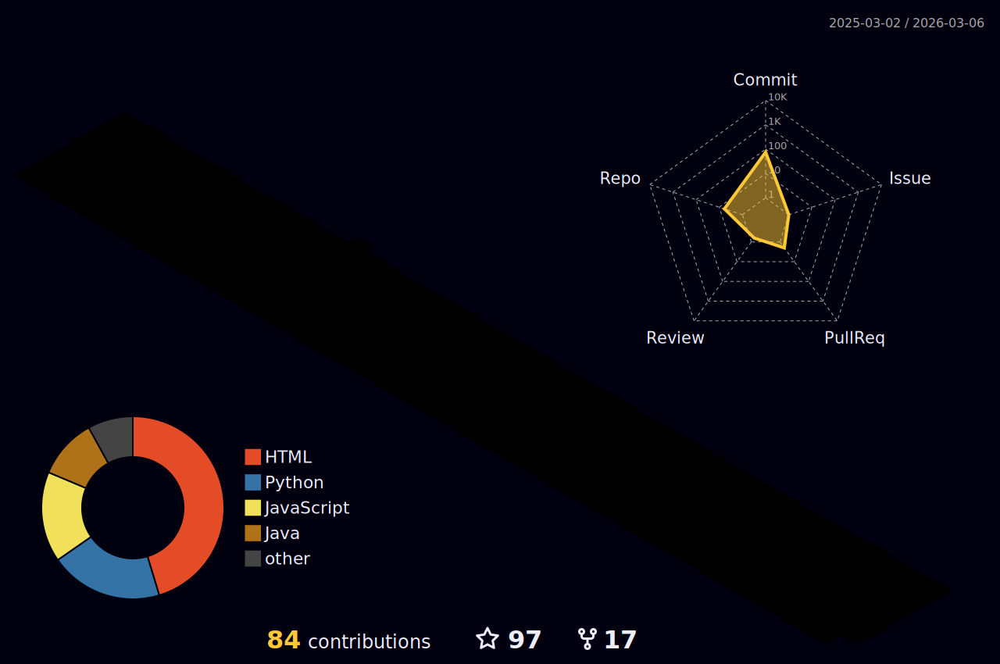

<h1 align="center">
  <a href="https://git.io/typing-svg">
    
   
    
  </a>
  
</h1>

  

<!--- 👨‍💻 I’m currently learning **Java**

- 💻 I’m currently working on ___

- 📫 How to reach me **ashfaaq.rifath2@gmail.com**

- 🌐 [ Portofolio site](https://ashfaaqrifath.github.io)-->

<h3 align="left">🔔Activity</h3>
<h6 align="center">
  
</h6>

<h6 align="center">
  

      
</h6>

  

