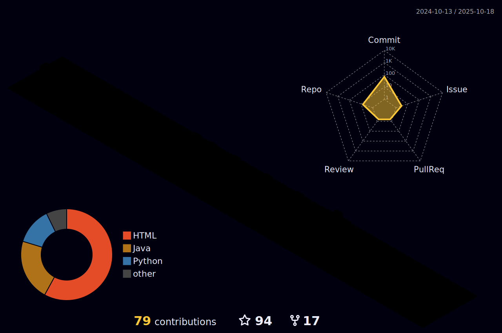

<h1 align="center">
  <a href="https://git.io/typing-svg">
    
   
    
  </a>
</h1>
  <h3></h3>
<h3>🏆GitHub trophy</h3>

 

<h1></h1>

- 👨‍💻 I’m currently working on [Chat Server](https://github.com/ashfaaqrifath/Chat-Server)

- 💻 I’m currently learning **Python** 🐍
  
- 🛠️ I love automation using Python

- 👌 I'm using [ Visual Studio Code](https://code.visualstudio.com/download)

- 📫 How to reach me **ashfaaq.rifath2@gmail.com**
<h1></h1>
<h3 align="left">🌎Social platforms</h3>

  

  

  

 
<h1></h1>

<h3 align="left">💻Languages and Tools</h3>

  

  
    
<h1></h1>
<h3 align="left">⚡Top Repositories</h3>

&nbsp;&nbsp;&nbsp;&nbsp;&nbsp;&nbsp;&nbsp;&nbsp;&nbsp;            
<h1></h1>

<h3 align="left">🔔Activity</h3>
<h6 align="center">
  
</h6>

<h6 align="center">
  

      
</h6>

<h6 align="center">
  
</h6>
